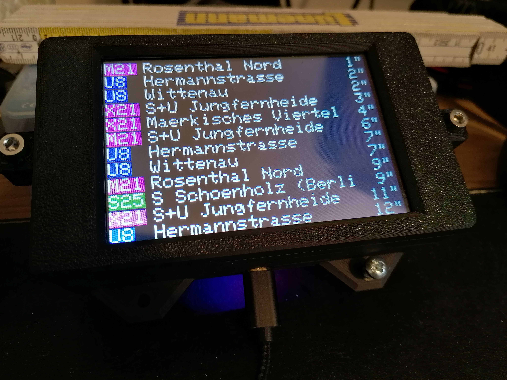
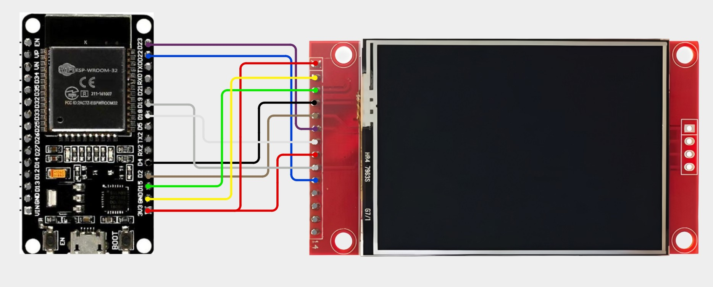
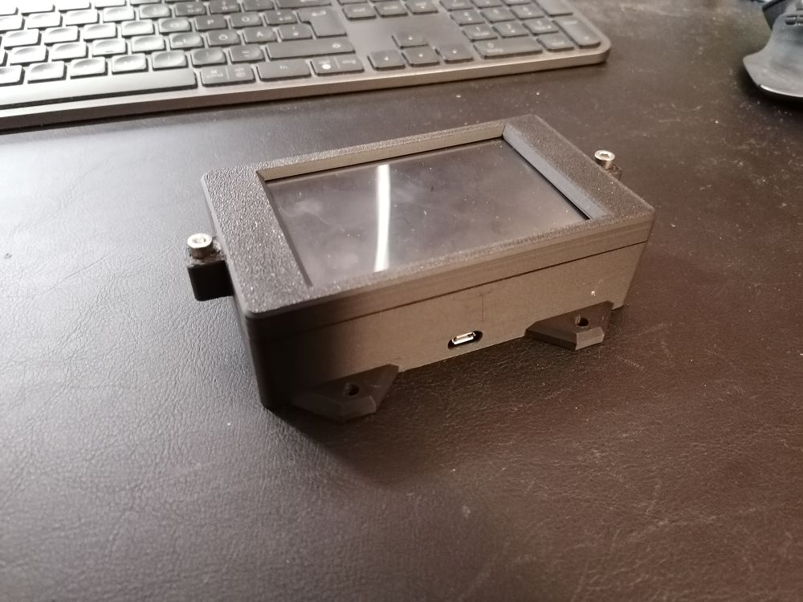
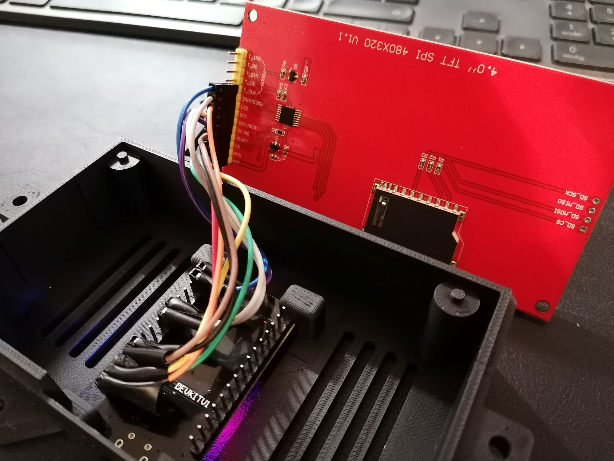
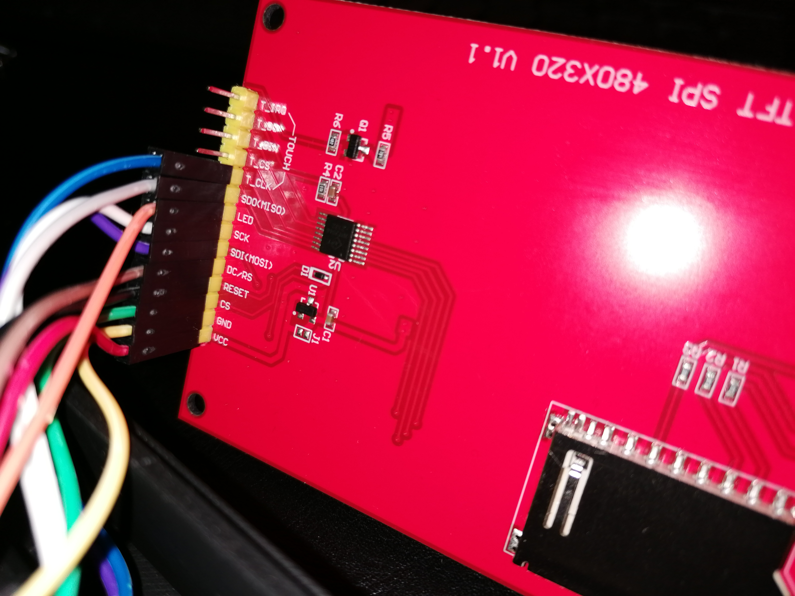
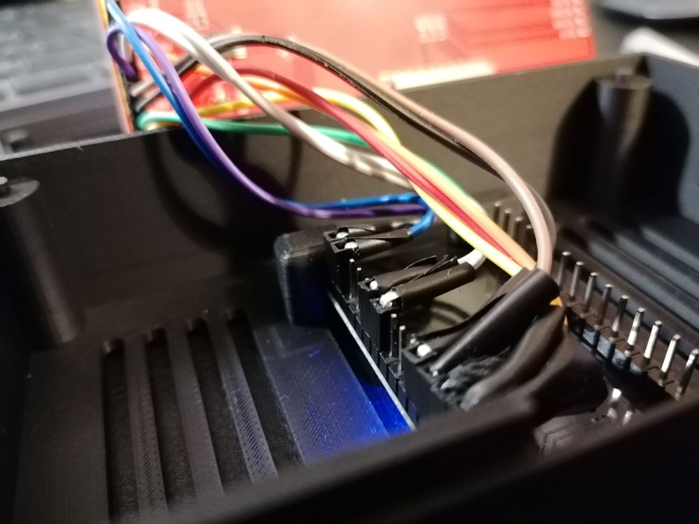
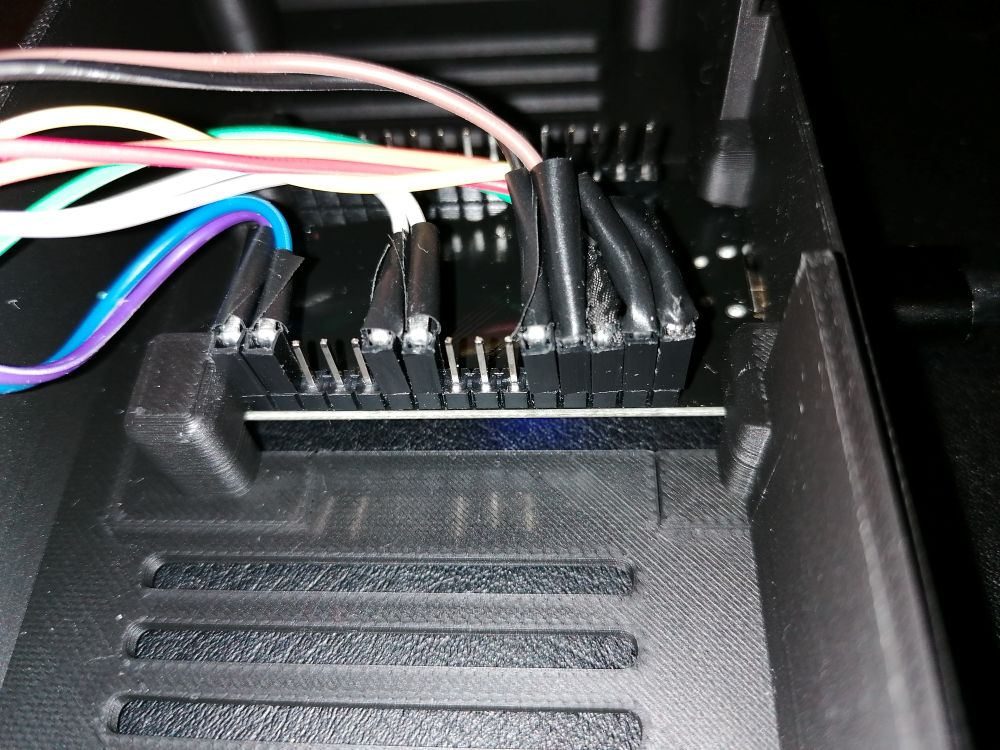
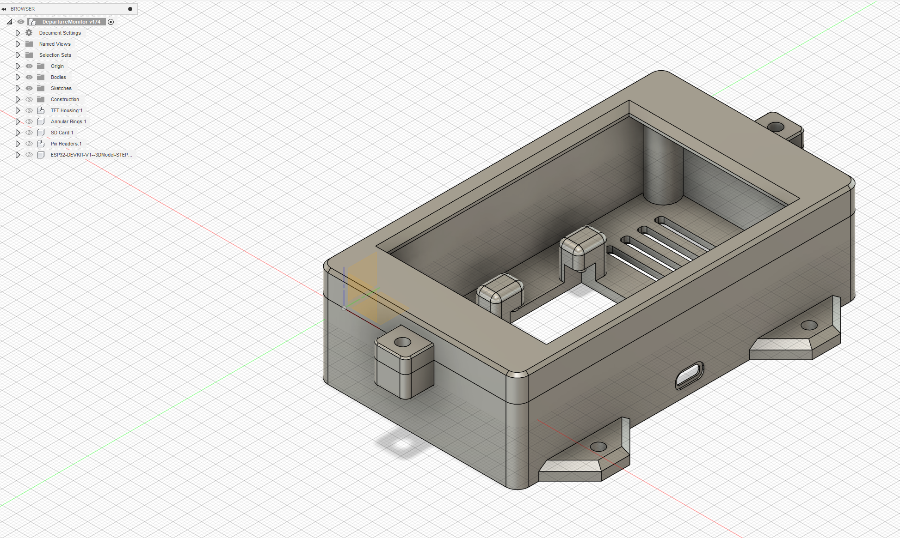
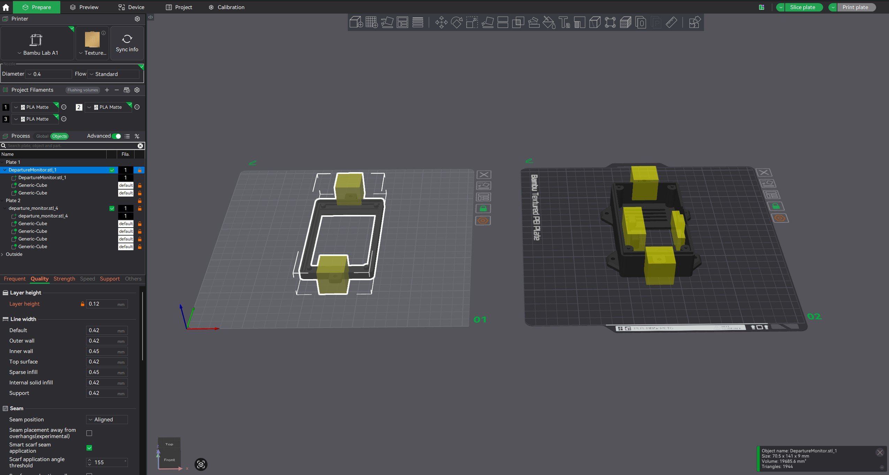

# Departure Monitor
Day-to-day life in Germany’s capital, Berlin, can be quite chaotic and stressful from time to time.
That’s why a live departure monitor which automatically updates every minute can be an incredibly useful companion — showing you when the next train, bus, subway, or tram will arrive right in front of your house.

I often found myself quite bothered by constantly checking my phones' app to see when the next connection would arrive at my nearest station.
That led to the idea for Departure Monitor - a small DIY device that continuously displays real-time departure data from the public transport system.

With this ESP32-powered gadget, you will have up-to-date information for your preferred station at a glance.


<div style="text-align: center;">

</div>

## Features
- Live Updates — Fetches real-time departure data every minute from the public VBB API
- Compact DIY Design — Built around an ESP32 microcontroller and a small display
- Open Source — Includes all models, print files, and source code
- Easy Setup — Simple to assemble and flash using the Arduino IDE
- Configurable — Adjust your station, preferred lines, and directions


# Repository Contents
- Fusion 360 model (.f3d)
- 3D print files (.stl, .3mf for BambuLab)
- Pin configuration and wiring diagram
- Source code for ESP32 (Arduino IDE)
- Images and assembly instructions

## Arduino IDE Setup:
- ArduinoJson 7.4.2
- TFT_eSPI 2.5.43
- ArduinoHttpClient 0.6.1


## TFT_eSPI lib
In ***Arduino\libraries*** path, file structure should look like the following:

TFT_eSPI\ ...
TFT_eSPI\User_Setup_Select.h

TFT_eSPI_Setups\mySetup27_ST7796_ESP32.h


## Pin Configuration
<div style="text-align: center;">

</div>


## Prepare API URL
Refer to the official [VBB API documentation](https://v6.vbb.transport.rest/api.html) to prepare your user specific api call.

```cpp
#define DEP_LIMIT 20 // define a dept limit, how many entries you want to fetch in one api call (limited to 100/min.)
```

```cpp
String apiURL = "https://v6.vbb.transport.rest/stops/900100003/departures?duration=60&lines=true&results=" + String(DEP_LIMIT);
```

For this api call I used ```GET /stops/:id/departures``` to get all departures at the stop/station.

- ```id: 900100003``` - ***S+U Alexanderplatz*** (https://v6.vbb.transport.rest/stops/900100003/departures)
- ```duration``` - in minutes for the next upcoming departures
- ```lines``` - returns stops/stations along the line when set to ```true```


## Hardware Parts:
- Display: 4" TFT SPI 480x320 ST7796S [display amazon](https://www.amazon.de/dp/B0CQ87KN3Q?ref=ppx_yo2ov_dt_b_fed_asin_title&th=1)

- ESP32 starter kit [esp32 kit amazon](https://www.amazon.de/dp/B0CTMQQ1W4?ref=ppx_yo2ov_dt_b_fed_asin_title)

- jumper cables: [cables short amazon](https://www.amazon.de/dp/B08HQ7K6M7?ref=ppx_yo2ov_dt_b_fed_asin_title)

<div style="text-align: center;">









 The housing has been printed with a bambulab A1 0.4 mm print nozzle and PLA standard filament. Layer height has been set to 0.12 mm which gave appropriate results.

</div>

